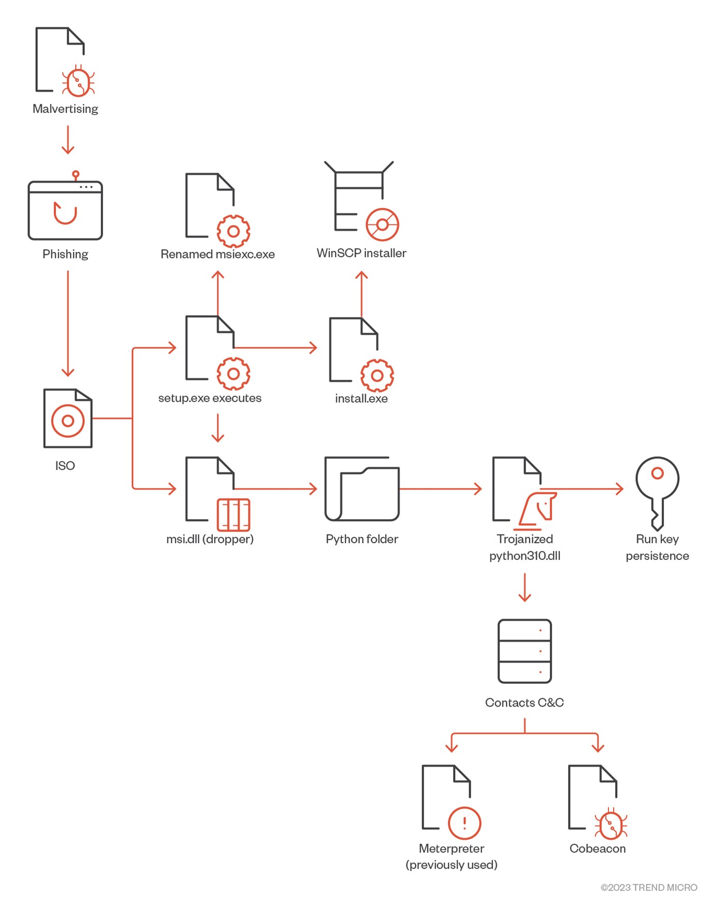

Advertising platforms like Google Ads enable businesses to display advertisements to target audiences to boost traffic and increase sales. Malware distributors abuse the same functionality in a technique known as malvertising, where chosen keywords are hijacked to display malicious ads that lure unsuspecting search engine users into downloading certain types of malware.

The following chart represents how the infection starts:

The infection starts once the user searches for “WinSCP Download” on the Bing search engine. A malicious ad for the WinSCP application is displayed above the organic search results. The ad leads to a suspicious website containing a tutorial on how to use WinSCP for automating file transfer:

See more details on [Trendmicro blog](https://www.trendmicro.com/en_us/research/23/f/malvertising-used-as-entry-vector-for-blackcat-actors-also-lever.html)
